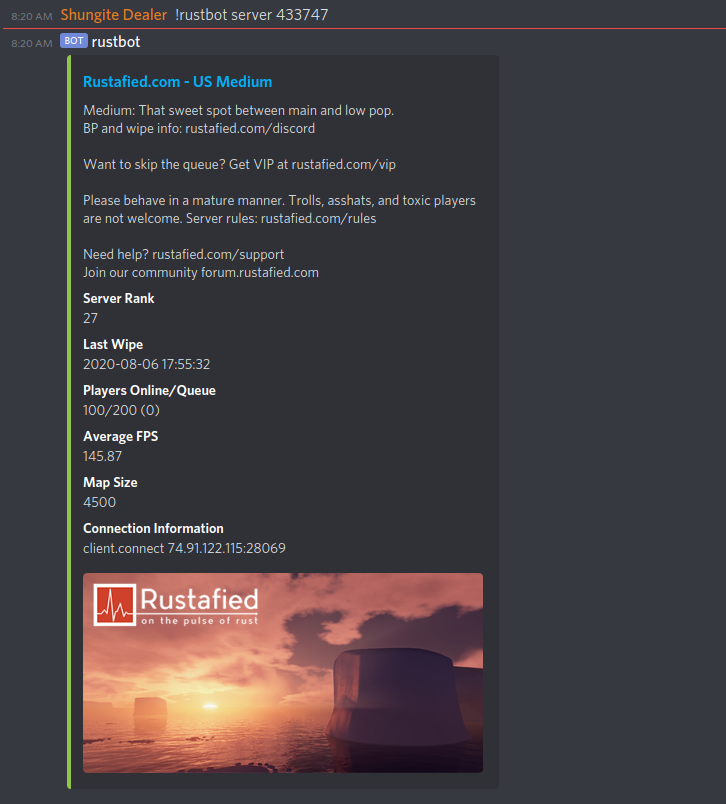

<p align="center">
  
</p>


### Overview
Rustbot is a [Discord](https://discordapp.com/) bot written using the [discordgo](https://github.com/bwmarrin/discordgo) framework. It was written to find out if a specific server me and a few buddies play on had a queue, but turned into much more. You can use this bot to search for any [Rust](https://rust.facepunch.com/) server and find out details like last wipe, server population (queue), average fps, map size and more.

### Usage

In any authorized Discord channel type `!rustbot help` for a list of commands.

```
Rustbot is a discord bot to help you pick a rust server to play on.

!rustbot top - the top command will return the top 25 ranked rust servers on battlemetrics.
!rustbot server [id] - the server command will lookup the id you provided and return you detailed information about the rust server. you can get the id from the !rustbot top command.
!rustbot search [query] - the search command will perform a search based off your query. it will return you a list of servers matching the search sorted by rank.
!rustbot commits - the commits command will link you to the facepunch official site to view the latest commits for the game.
!rustbot roadmap - the roadmap command will link you to the rust roadmap.
```


### Building the Application


```
$ make build
```

Yep. That's it. You should see the following output:

```
$ docker build -t rustbot:latest .
...
Successfully built 84281fcf926b
Successfully tagged rustbot:latest

$ docker images
REPOSITORY          TAG                 IMAGE ID            CREATED             SIZE
rustbot             latest              84281fcf926b        13 seconds ago      8.93MB
```

### Deploying

```
$ docker run -e "DISCORD_TOKEN=XXXXXXXXXXXXXXXXXXXXXX" rustbot:latest
Bot is now running.  Press CTRL-C to exit.
```
